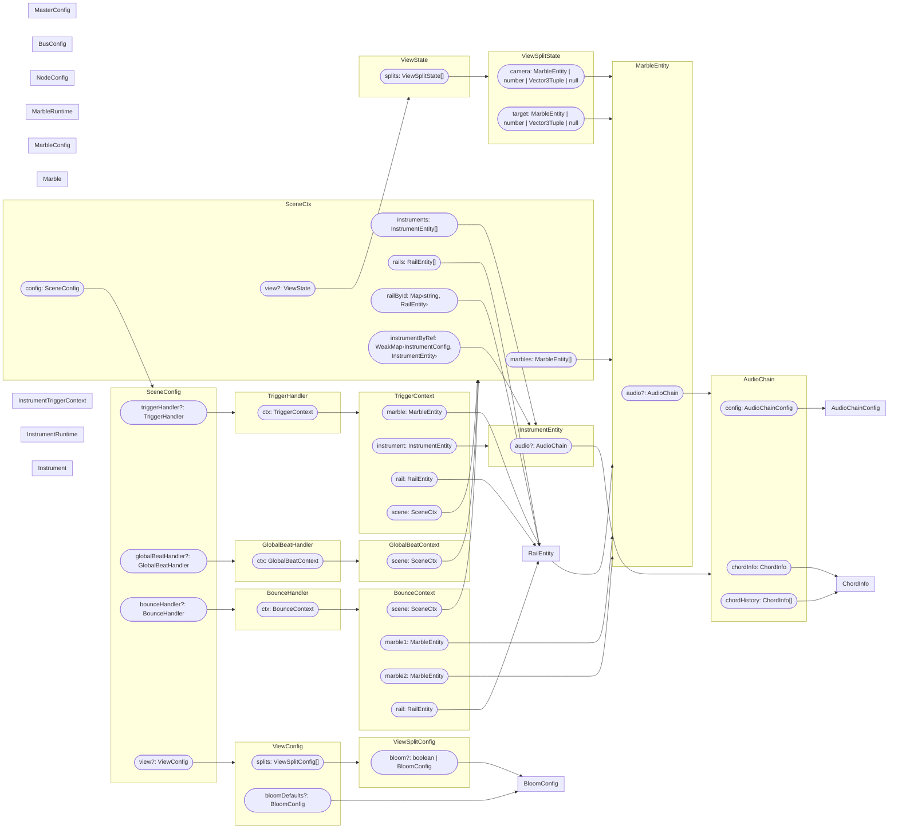

# Architecture

```mermaid
flowchart LR

  subgraph SceneConfig["SceneConfig"]
    SceneConfig__triggerHandler(["triggerHandler?: TriggerHandler"])
    SceneConfig__globalBeatHandler(["globalBeatHandler?: GlobalBeatHandler"])
    SceneConfig__bounceHandler(["bounceHandler?: BounceHandler"])
    SceneConfig__view(["view?: ViewConfig"])
  end

  subgraph Instrument["Instrument"]
  end

  subgraph InstrumentRuntime["InstrumentRuntime"]
  end

  subgraph ViewConfig["ViewConfig"]
    ViewConfig__splits(["splits: ViewSplitConfig[]"])
    ViewConfig__bloomDefaults(["bloomDefaults?: BloomConfig"])
  end

  subgraph ViewSplitConfig["ViewSplitConfig"]
    ViewSplitConfig__bloom(["bloom?: boolean | BloomConfig"])
  end

  subgraph BloomConfig["BloomConfig"]
  end

  subgraph TriggerContext["TriggerContext"]
    TriggerContext__marble(["marble: MarbleEntity"])
    TriggerContext__instrument(["instrument: InstrumentEntity"])
    TriggerContext__rail(["rail: RailEntity"])
    TriggerContext__scene(["scene: SceneCtx"])
  end

  subgraph TriggerHandler["TriggerHandler"]
    TriggerHandler__ctx(["ctx: TriggerContext"])
  end

  subgraph BounceContext["BounceContext"]
    BounceContext__scene(["scene: SceneCtx"])
    BounceContext__marble1(["marble1: MarbleEntity"])
    BounceContext__marble2(["marble2: MarbleEntity"])
    BounceContext__rail(["rail: RailEntity"])
  end

  subgraph BounceHandler["BounceHandler"]
    BounceHandler__ctx(["ctx: BounceContext"])
  end

  subgraph GlobalBeatContext["GlobalBeatContext"]
    GlobalBeatContext__scene(["scene: SceneCtx"])
  end

  subgraph GlobalBeatHandler["GlobalBeatHandler"]
    GlobalBeatHandler__ctx(["ctx: GlobalBeatContext"])
  end

  subgraph InstrumentTriggerContext["InstrumentTriggerContext"]
  end

  subgraph SceneCtx["SceneCtx"]
    SceneCtx__marbles(["marbles: MarbleEntity[]"])
    SceneCtx__instruments(["instruments: InstrumentEntity[]"])
    SceneCtx__rails(["rails: RailEntity[]"])
    SceneCtx__railById(["railById: Map‹string, RailEntity›"])
    SceneCtx__instrumentByRef(["instrumentByRef: WeakMap‹InstrumentConfig, InstrumentEntity›"])
    SceneCtx__config(["config: SceneConfig"])
    SceneCtx__view(["view?: ViewState"])
  end

  subgraph MarbleEntity["MarbleEntity"]
    MarbleEntity__audio(["audio?: AudioChain"])
  end

  subgraph InstrumentEntity["InstrumentEntity"]
    InstrumentEntity__audio(["audio?: AudioChain"])
  end

  subgraph RailEntity["RailEntity"]
  end

  subgraph ViewState["ViewState"]
    ViewState__splits(["splits: ViewSplitState[]"])
  end

  subgraph ViewSplitState["ViewSplitState"]
    ViewSplitState__camera(["camera: MarbleEntity | number | Vector3Tuple | null"])
    ViewSplitState__target(["target: MarbleEntity | number | Vector3Tuple | null"])
  end

  subgraph Marble["Marble"]
  end

  subgraph MarbleConfig["MarbleConfig"]
  end

  subgraph MarbleRuntime["MarbleRuntime"]
  end

  subgraph AudioChainConfig["AudioChainConfig"]
  end

  subgraph NodeConfig["NodeConfig"]
  end

  subgraph AudioChain["AudioChain"]
    AudioChain__config(["config: AudioChainConfig"])
    AudioChain__chordInfo(["chordInfo: ChordInfo"])
    AudioChain__chordHistory(["chordHistory: ChordInfo[]"])
  end

  subgraph BusConfig["BusConfig"]
  end

  subgraph MasterConfig["MasterConfig"]
  end

  subgraph ChordInfo["ChordInfo"]
  end

  %% Inheritance

  %% Relationships
  SceneConfig__triggerHandler --> TriggerHandler
  SceneConfig__globalBeatHandler --> GlobalBeatHandler
  SceneConfig__bounceHandler --> BounceHandler
  SceneConfig__view --> ViewConfig
  ViewConfig__splits --> ViewSplitConfig
  ViewConfig__bloomDefaults --> BloomConfig
  ViewSplitConfig__bloom --> BloomConfig
  TriggerContext__marble --> MarbleEntity
  TriggerContext__instrument --> InstrumentEntity
  TriggerContext__rail --> RailEntity
  TriggerContext__scene --> SceneCtx
  TriggerHandler__ctx --> TriggerContext
  BounceContext__scene --> SceneCtx
  BounceContext__marble1 --> MarbleEntity
  BounceContext__marble2 --> MarbleEntity
  BounceContext__rail --> RailEntity
  BounceHandler__ctx --> BounceContext
  GlobalBeatContext__scene --> SceneCtx
  GlobalBeatHandler__ctx --> GlobalBeatContext
  SceneCtx__marbles --> MarbleEntity
  SceneCtx__instruments --> InstrumentEntity
  SceneCtx__rails --> RailEntity
  SceneCtx__railById --> RailEntity
  SceneCtx__instrumentByRef --> InstrumentEntity
  SceneCtx__config --> SceneConfig
  SceneCtx__view --> ViewState
  MarbleEntity__audio --> AudioChain
  InstrumentEntity__audio --> AudioChain
  ViewState__splits --> ViewSplitState
  ViewSplitState__camera --> MarbleEntity
  ViewSplitState__target --> MarbleEntity
  AudioChain__config --> AudioChainConfig
  AudioChain__chordInfo --> ChordInfo
  AudioChain__chordHistory --> ChordInfo
```
