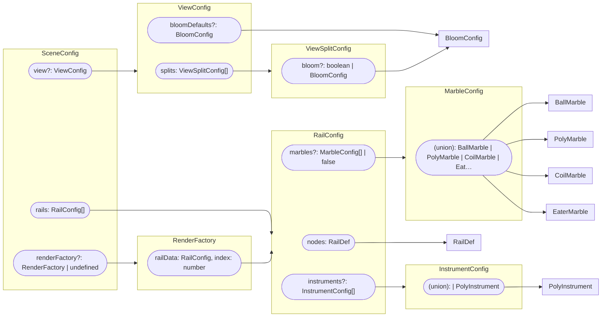

# Architecture

## SceneConfig

```mermaid
flowchart LR

  subgraph SceneConfig["SceneConfig"]
    SceneConfig__rails(["rails: RailConfig[]"])
    SceneConfig__renderFactory(["renderFactory?: RenderFactory | undefined"])
    SceneConfig__view(["view?: ViewConfig"])
  end

  subgraph RailConfig["RailConfig"]
    RailConfig__nodes(["nodes: RailDef"])
    RailConfig__marbles(["marbles?: MarbleConfig[] | false"])
    RailConfig__instruments(["instruments?: InstrumentConfig[]"])
  end

  subgraph RenderFactory["RenderFactory"]
    RenderFactory__railData(["railData: RailConfig, index: number"])
  end

  subgraph ViewConfig["ViewConfig"]
    ViewConfig__splits(["splits: ViewSplitConfig[]"])
    ViewConfig__bloomDefaults(["bloomDefaults?: BloomConfig"])
  end

  subgraph RailDef["RailDef"]
  end

  subgraph MarbleConfig["MarbleConfig"]
    MarbleConfig___union_(["(union): BallMarble | PolyMarble | CoilMarble | Eat…"])
  end

  subgraph InstrumentConfig["InstrumentConfig"]
    InstrumentConfig___union_(["(union): | PolyInstrument"])
  end

  subgraph ViewSplitConfig["ViewSplitConfig"]
    ViewSplitConfig__bloom(["bloom?: boolean | BloomConfig"])
  end

  subgraph BloomConfig["BloomConfig"]
  end

  subgraph BallMarble["BallMarble"]
  end

  subgraph PolyMarble["PolyMarble"]
  end

  subgraph CoilMarble["CoilMarble"]
  end

  subgraph EaterMarble["EaterMarble"]
  end

  subgraph PolyInstrument["PolyInstrument"]
  end

  %% Inheritance

  %% Relationships
  SceneConfig__rails --> RailConfig
  SceneConfig__renderFactory --> RenderFactory
  SceneConfig__view --> ViewConfig
  RailConfig__nodes --> RailDef
  RailConfig__marbles --> MarbleConfig
  RailConfig__instruments --> InstrumentConfig
  RenderFactory__railData --> RailConfig
  ViewConfig__splits --> ViewSplitConfig
  ViewConfig__bloomDefaults --> BloomConfig
  MarbleConfig___union_ --> BallMarble
  MarbleConfig___union_ --> PolyMarble
  MarbleConfig___union_ --> CoilMarble
  MarbleConfig___union_ --> EaterMarble
  InstrumentConfig___union_ --> PolyInstrument
  ViewSplitConfig__bloom --> BloomConfig
```

## SceneCtx

```mermaid
flowchart LR

  subgraph SceneCtx["SceneCtx"]
    SceneCtx__marbles(["marbles: MarbleEntity[]"])
    SceneCtx__instruments(["instruments: InstrumentEntity[]"])
    SceneCtx__rails(["rails: RailEntity[]"])
    SceneCtx__railById(["railById: Map‹string, RailEntity›"])
    SceneCtx__instrumentByRef(["instrumentByRef: WeakMap‹InstrumentConfig, InstrumentEntity›"])
    SceneCtx__config(["config: SceneConfig"])
    SceneCtx__view(["view?: ViewState"])
  end

  subgraph MarbleEntity["MarbleEntity"]
    MarbleEntity__marble(["marble: MarbleInstance"])
    MarbleEntity__audio(["audio?: AudioChain"])
  end

  subgraph InstrumentEntity["InstrumentEntity"]
    InstrumentEntity__instrument(["instrument: InstrumentConfig"])
    InstrumentEntity__audio(["audio?: AudioChain"])
  end

  subgraph RailEntity["RailEntity"]
    RailEntity__railData(["railData: RailConfig"])
    RailEntity__resolvedRail(["resolvedRail: ResolvedRail"])
    RailEntity__runtime(["runtime: RailRuntime"])
  end

  subgraph InstrumentConfig["InstrumentConfig"]
    InstrumentConfig___union_(["(union): | PolyInstrument"])
  end

  subgraph SceneConfig["SceneConfig"]
    SceneConfig__rails(["rails: RailConfig[]"])
    SceneConfig__triggerHandler(["triggerHandler?: TriggerHandler"])
    SceneConfig__globalBeatHandler(["globalBeatHandler?: GlobalBeatHandler"])
    SceneConfig__bounceHandler(["bounceHandler?: BounceHandler"])
    SceneConfig__renderFactory(["renderFactory?: RenderFactory | undefined"])
    SceneConfig__view(["view?: ViewConfig"])
  end

  subgraph ViewState["ViewState"]
    ViewState__splits(["splits: ViewSplitState[]"])
  end

  subgraph MarbleInstance["MarbleInstance"]
    MarbleInstance__resolved(["resolved: ResolvedMarble"])
    MarbleInstance__runtime(["runtime: MarbleRuntime"])
    MarbleInstance__direction(["direction: MarbleDirection"])
    MarbleInstance__midiSignal(["midiSignal: InstrumentSignal"])
  end

  subgraph AudioChain["AudioChain"]
    AudioChain__config(["config: AudioChainConfig"])
    AudioChain__voices(["voices: VoiceTracker"])
    AudioChain__nodePresets(["nodePresets: Map‹number, NodePresetInfo›"])
    AudioChain__chordInfo(["chordInfo: ChordInfo"])
    AudioChain__chordHistory(["chordHistory: ChordInfo[]"])
  end

  subgraph RailConfig["RailConfig"]
    RailConfig__nodes(["nodes: RailDef"])
    RailConfig__offset(["offset?: Vec3"])
    RailConfig__marbles(["marbles?: MarbleConfig[] | false"])
    RailConfig__instruments(["instruments?: InstrumentConfig[]"])
    RailConfig__render(["render?: RailRender"])
  end

  subgraph ResolvedRail["ResolvedRail"]
  end

  subgraph RailRuntime["RailRuntime"]
  end

  subgraph PolyInstrument["PolyInstrument"]
  end

  subgraph TriggerHandler["TriggerHandler"]
    TriggerHandler__ctx(["ctx: TriggerContext"])
  end

  subgraph GlobalBeatHandler["GlobalBeatHandler"]
    GlobalBeatHandler__ctx(["ctx: GlobalBeatContext"])
  end

  subgraph BounceHandler["BounceHandler"]
    BounceHandler__ctx(["ctx: BounceContext"])
  end

  subgraph RenderFactory["RenderFactory"]
    RenderFactory__railData(["railData: RailConfig, index: number"])
  end

  subgraph ViewConfig["ViewConfig"]
    ViewConfig__splits(["splits: ViewSplitConfig[]"])
    ViewConfig__bloomDefaults(["bloomDefaults?: BloomConfig"])
  end

  subgraph ViewSplitState["ViewSplitState"]
    ViewSplitState__camera(["camera: MarbleEntity | number | Vector3Tuple | null"])
    ViewSplitState__target(["target: MarbleEntity | number | Vector3Tuple | null"])
  end

  subgraph ResolvedMarble["ResolvedMarble"]
    ResolvedMarble__resolvedRail(["resolvedRail: ResolvedRail"])
    ResolvedMarble__direction(["direction: MarbleDirection"])
    ResolvedMarble__sequenceMode(["sequenceMode: MarbleSequenceMode"])
    ResolvedMarble__easing(["easing: EasingMode"])
    ResolvedMarble__type(["type?: MarbleType"])
  end

  subgraph MarbleRuntime["MarbleRuntime"]
    MarbleRuntime__lastTriggeredDirection(["lastTriggeredDirection?: MarbleDirection"])
    MarbleRuntime__type(["type?: MarbleType"])
    MarbleRuntime__easing(["easing?: EasingMode"])
  end

  subgraph MarbleDirection["MarbleDirection"]
  end

  subgraph InstrumentSignal["InstrumentSignal"]
  end

  subgraph AudioChainConfig["AudioChainConfig"]
    AudioChainConfig__generator(["generator?: GeneratorConfig"])
    AudioChainConfig__fx(["fx?: FxConfig[]"])
    AudioChainConfig__analyzer(["analyzer?: AnalyzerType"])
  end

  subgraph VoiceTracker["VoiceTracker"]
  end

  subgraph NodePresetInfo["NodePresetInfo"]
  end

  subgraph ChordInfo["ChordInfo"]
  end

  subgraph RailDef["RailDef"]
    RailDef___union_(["(union): RailNode[]"])
  end

  subgraph Vec3["Vec3"]
  end

  subgraph MarbleConfig["MarbleConfig"]
    MarbleConfig___union_(["(union): BallMarble | PolyMarble | CoilMarble | Eat…"])
  end

  subgraph RailRender["RailRender"]
    RailRender__out(["out: Matrix4, ctx: SceneCtx, beat: number, temp…"])
  end

  subgraph TriggerContext["TriggerContext"]
    TriggerContext__marble(["marble: MarbleEntity"])
    TriggerContext__instrument(["instrument: InstrumentEntity"])
    TriggerContext__rail(["rail: RailEntity"])
    TriggerContext__scene(["scene: SceneCtx"])
  end

  subgraph GlobalBeatContext["GlobalBeatContext"]
    GlobalBeatContext__scene(["scene: SceneCtx"])
  end

  subgraph BounceContext["BounceContext"]
    BounceContext__scene(["scene: SceneCtx"])
    BounceContext__marble1(["marble1: MarbleEntity"])
    BounceContext__marble2(["marble2: MarbleEntity"])
    BounceContext__rail(["rail: RailEntity"])
  end

  subgraph ViewSplitConfig["ViewSplitConfig"]
    ViewSplitConfig__bloom(["bloom?: boolean | BloomConfig"])
  end

  subgraph BloomConfig["BloomConfig"]
  end

  subgraph MarbleSequenceMode["MarbleSequenceMode"]
  end

  subgraph EasingMode["EasingMode"]
  end

  subgraph MarbleType["MarbleType"]
  end

  subgraph GeneratorConfig["GeneratorConfig"]
    GeneratorConfig___union_(["(union): NodeConfig"])
  end

  subgraph FxConfig["FxConfig"]
    FxConfig___union_(["(union): NodeConfig"])
  end

  subgraph AnalyzerType["AnalyzerType"]
  end

  subgraph RailNode["RailNode"]
    RailNode___union_(["(union): Vec3 | RailPointFull | RailSplit | string …"])
  end

  subgraph BallMarble["BallMarble"]
  end

  subgraph PolyMarble["PolyMarble"]
  end

  subgraph CoilMarble["CoilMarble"]
  end

  subgraph EaterMarble["EaterMarble"]
  end

  subgraph TempoState["TempoState"]
    TempoState__config(["config: TempoConfig"])
  end

  subgraph NodeConfig["NodeConfig"]
  end

  subgraph RailPointFull["RailPointFull"]
    RailPointFull__p(["p: Vec3"])
    RailPointFull__round(["round?: Rounding"])
  end

  subgraph RailSplit["RailSplit"]
  end

  subgraph Vec3Curve["Vec3Curve"]
    Vec3Curve___union_(["(union): | [x: number, y: number, z: number, Roundi…"])
  end

  subgraph TempoConfig["TempoConfig"]
  end

  subgraph Rounding["Rounding"]
  end

  %% Inheritance

  %% Relationships
  SceneCtx__marbles --> MarbleEntity
  SceneCtx__instruments --> InstrumentEntity
  SceneCtx__rails --> RailEntity
  SceneCtx__railById --> RailEntity
  SceneCtx__instrumentByRef --> InstrumentConfig
  SceneCtx__instrumentByRef --> InstrumentEntity
  SceneCtx__config --> SceneConfig
  SceneCtx__view --> ViewState
  MarbleEntity__marble --> MarbleInstance
  MarbleEntity__audio --> AudioChain
  InstrumentEntity__instrument --> InstrumentConfig
  InstrumentEntity__audio --> AudioChain
  RailEntity__railData --> RailConfig
  RailEntity__resolvedRail --> ResolvedRail
  RailEntity__runtime --> RailRuntime
  InstrumentConfig___union_ --> PolyInstrument
  SceneConfig__rails --> RailConfig
  SceneConfig__triggerHandler --> TriggerHandler
  SceneConfig__globalBeatHandler --> GlobalBeatHandler
  SceneConfig__bounceHandler --> BounceHandler
  SceneConfig__renderFactory --> RenderFactory
  SceneConfig__view --> ViewConfig
  ViewState__splits --> ViewSplitState
  MarbleInstance__resolved --> ResolvedMarble
  MarbleInstance__runtime --> MarbleRuntime
  MarbleInstance__direction --> MarbleDirection
  MarbleInstance__midiSignal --> InstrumentSignal
  AudioChain__config --> AudioChainConfig
  AudioChain__voices --> VoiceTracker
  AudioChain__nodePresets --> NodePresetInfo
  AudioChain__chordInfo --> ChordInfo
  AudioChain__chordHistory --> ChordInfo
  RailConfig__nodes --> RailDef
  RailConfig__offset --> Vec3
  RailConfig__marbles --> MarbleConfig
  RailConfig__instruments --> InstrumentConfig
  RailConfig__render --> RailRender
  TriggerHandler__ctx --> TriggerContext
  GlobalBeatHandler__ctx --> GlobalBeatContext
  BounceHandler__ctx --> BounceContext
  RenderFactory__railData --> RailConfig
  ViewConfig__splits --> ViewSplitConfig
  ViewConfig__bloomDefaults --> BloomConfig
  ViewSplitState__camera --> MarbleEntity
  ViewSplitState__target --> MarbleEntity
  ResolvedMarble__resolvedRail --> ResolvedRail
  ResolvedMarble__direction --> MarbleDirection
  ResolvedMarble__sequenceMode --> MarbleSequenceMode
  ResolvedMarble__easing --> EasingMode
  ResolvedMarble__type --> MarbleType
  MarbleRuntime__lastTriggeredDirection --> MarbleDirection
  MarbleRuntime__type --> MarbleType
  MarbleRuntime__easing --> EasingMode
  AudioChainConfig__generator --> GeneratorConfig
  AudioChainConfig__fx --> FxConfig
  AudioChainConfig__analyzer --> AnalyzerType
  RailDef___union_ --> RailNode
  MarbleConfig___union_ --> BallMarble
  MarbleConfig___union_ --> PolyMarble
  MarbleConfig___union_ --> CoilMarble
  MarbleConfig___union_ --> EaterMarble
  RailRender__out --> SceneCtx
  RailRender__out --> TempoState
  TriggerContext__marble --> MarbleEntity
  TriggerContext__instrument --> InstrumentEntity
  TriggerContext__rail --> RailEntity
  TriggerContext__scene --> SceneCtx
  GlobalBeatContext__scene --> SceneCtx
  BounceContext__scene --> SceneCtx
  BounceContext__marble1 --> MarbleEntity
  BounceContext__marble2 --> MarbleEntity
  BounceContext__rail --> RailEntity
  ViewSplitConfig__bloom --> BloomConfig
  GeneratorConfig___union_ --> NodeConfig
  FxConfig___union_ --> NodeConfig
  RailNode___union_ --> Vec3
  RailNode___union_ --> RailPointFull
  RailNode___union_ --> RailSplit
  RailNode___union_ --> Vec3Curve
  TempoState__config --> TempoConfig
  RailPointFull__p --> Vec3
  RailPointFull__round --> Rounding
  Vec3Curve___union_ --> Rounding
```

## TriggerContext

```mermaid
flowchart LR

  subgraph TriggerContext["TriggerContext"]
    TriggerContext__marble(["marble: MarbleEntity"])
    TriggerContext__instrument(["instrument: InstrumentEntity"])
    TriggerContext__rail(["rail: RailEntity"])
    TriggerContext__scene(["scene: SceneCtx"])
  end

  subgraph MarbleEntity["MarbleEntity"]
    MarbleEntity__marble(["marble: MarbleInstance"])
    MarbleEntity__audio(["audio?: AudioChain"])
  end

  subgraph InstrumentEntity["InstrumentEntity"]
    InstrumentEntity__instrument(["instrument: InstrumentConfig"])
    InstrumentEntity__audio(["audio?: AudioChain"])
  end

  subgraph RailEntity["RailEntity"]
    RailEntity__railData(["railData: RailConfig"])
    RailEntity__resolvedRail(["resolvedRail: ResolvedRail"])
    RailEntity__runtime(["runtime: RailRuntime"])
  end

  subgraph SceneCtx["SceneCtx"]
    SceneCtx__marbles(["marbles: MarbleEntity[]"])
    SceneCtx__instruments(["instruments: InstrumentEntity[]"])
    SceneCtx__rails(["rails: RailEntity[]"])
    SceneCtx__railById(["railById: Map‹string, RailEntity›"])
    SceneCtx__instrumentByRef(["instrumentByRef: WeakMap‹InstrumentConfig, InstrumentEntity›"])
    SceneCtx__config(["config: SceneConfig"])
    SceneCtx__view(["view?: ViewState"])
  end

  subgraph MarbleInstance["MarbleInstance"]
    MarbleInstance__resolved(["resolved: ResolvedMarble"])
    MarbleInstance__runtime(["runtime: MarbleRuntime"])
    MarbleInstance__direction(["direction: MarbleDirection"])
    MarbleInstance__midiSignal(["midiSignal: InstrumentSignal"])
  end

  subgraph AudioChain["AudioChain"]
    AudioChain__config(["config: AudioChainConfig"])
    AudioChain__voices(["voices: VoiceTracker"])
    AudioChain__nodePresets(["nodePresets: Map‹number, NodePresetInfo›"])
    AudioChain__chordInfo(["chordInfo: ChordInfo"])
    AudioChain__chordHistory(["chordHistory: ChordInfo[]"])
  end

  subgraph InstrumentConfig["InstrumentConfig"]
    InstrumentConfig___union_(["(union): | PolyInstrument"])
  end

  subgraph RailConfig["RailConfig"]
    RailConfig__nodes(["nodes: RailDef"])
    RailConfig__offset(["offset?: Vec3"])
    RailConfig__marbles(["marbles?: MarbleConfig[] | false"])
    RailConfig__instruments(["instruments?: InstrumentConfig[]"])
    RailConfig__render(["render?: RailRender"])
  end

  subgraph ResolvedRail["ResolvedRail"]
  end

  subgraph RailRuntime["RailRuntime"]
  end

  subgraph SceneConfig["SceneConfig"]
    SceneConfig__rails(["rails: RailConfig[]"])
    SceneConfig__triggerHandler(["triggerHandler?: TriggerHandler"])
    SceneConfig__globalBeatHandler(["globalBeatHandler?: GlobalBeatHandler"])
    SceneConfig__bounceHandler(["bounceHandler?: BounceHandler"])
    SceneConfig__renderFactory(["renderFactory?: RenderFactory | undefined"])
    SceneConfig__view(["view?: ViewConfig"])
  end

  subgraph ViewState["ViewState"]
    ViewState__splits(["splits: ViewSplitState[]"])
  end

  subgraph ResolvedMarble["ResolvedMarble"]
    ResolvedMarble__resolvedRail(["resolvedRail: ResolvedRail"])
    ResolvedMarble__direction(["direction: MarbleDirection"])
    ResolvedMarble__sequenceMode(["sequenceMode: MarbleSequenceMode"])
    ResolvedMarble__easing(["easing: EasingMode"])
    ResolvedMarble__type(["type?: MarbleType"])
  end

  subgraph MarbleRuntime["MarbleRuntime"]
    MarbleRuntime__lastTriggeredDirection(["lastTriggeredDirection?: MarbleDirection"])
    MarbleRuntime__type(["type?: MarbleType"])
    MarbleRuntime__easing(["easing?: EasingMode"])
  end

  subgraph MarbleDirection["MarbleDirection"]
  end

  subgraph InstrumentSignal["InstrumentSignal"]
  end

  subgraph AudioChainConfig["AudioChainConfig"]
    AudioChainConfig__generator(["generator?: GeneratorConfig"])
    AudioChainConfig__fx(["fx?: FxConfig[]"])
    AudioChainConfig__analyzer(["analyzer?: AnalyzerType"])
  end

  subgraph VoiceTracker["VoiceTracker"]
  end

  subgraph NodePresetInfo["NodePresetInfo"]
  end

  subgraph ChordInfo["ChordInfo"]
  end

  subgraph PolyInstrument["PolyInstrument"]
  end

  subgraph RailDef["RailDef"]
    RailDef___union_(["(union): RailNode[]"])
  end

  subgraph Vec3["Vec3"]
  end

  subgraph MarbleConfig["MarbleConfig"]
    MarbleConfig___union_(["(union): BallMarble | PolyMarble | CoilMarble | Eat…"])
  end

  subgraph RailRender["RailRender"]
    RailRender__out(["out: Matrix4, ctx: SceneCtx, beat: number, temp…"])
  end

  subgraph TriggerHandler["TriggerHandler"]
    TriggerHandler__ctx(["ctx: TriggerContext"])
  end

  subgraph GlobalBeatHandler["GlobalBeatHandler"]
    GlobalBeatHandler__ctx(["ctx: GlobalBeatContext"])
  end

  subgraph BounceHandler["BounceHandler"]
    BounceHandler__ctx(["ctx: BounceContext"])
  end

  subgraph RenderFactory["RenderFactory"]
    RenderFactory__railData(["railData: RailConfig, index: number"])
  end

  subgraph ViewConfig["ViewConfig"]
    ViewConfig__splits(["splits: ViewSplitConfig[]"])
    ViewConfig__bloomDefaults(["bloomDefaults?: BloomConfig"])
  end

  subgraph ViewSplitState["ViewSplitState"]
    ViewSplitState__camera(["camera: MarbleEntity | number | Vector3Tuple | null"])
    ViewSplitState__target(["target: MarbleEntity | number | Vector3Tuple | null"])
  end

  subgraph MarbleSequenceMode["MarbleSequenceMode"]
  end

  subgraph EasingMode["EasingMode"]
  end

  subgraph MarbleType["MarbleType"]
  end

  subgraph GeneratorConfig["GeneratorConfig"]
    GeneratorConfig___union_(["(union): NodeConfig"])
  end

  subgraph FxConfig["FxConfig"]
    FxConfig___union_(["(union): NodeConfig"])
  end

  subgraph AnalyzerType["AnalyzerType"]
  end

  subgraph RailNode["RailNode"]
    RailNode___union_(["(union): Vec3 | RailPointFull | RailSplit | string …"])
  end

  subgraph BallMarble["BallMarble"]
  end

  subgraph PolyMarble["PolyMarble"]
  end

  subgraph CoilMarble["CoilMarble"]
  end

  subgraph EaterMarble["EaterMarble"]
  end

  subgraph TempoState["TempoState"]
    TempoState__config(["config: TempoConfig"])
  end

  subgraph GlobalBeatContext["GlobalBeatContext"]
    GlobalBeatContext__scene(["scene: SceneCtx"])
  end

  subgraph BounceContext["BounceContext"]
    BounceContext__scene(["scene: SceneCtx"])
    BounceContext__marble1(["marble1: MarbleEntity"])
    BounceContext__marble2(["marble2: MarbleEntity"])
    BounceContext__rail(["rail: RailEntity"])
  end

  subgraph ViewSplitConfig["ViewSplitConfig"]
    ViewSplitConfig__bloom(["bloom?: boolean | BloomConfig"])
  end

  subgraph BloomConfig["BloomConfig"]
  end

  subgraph NodeConfig["NodeConfig"]
  end

  subgraph RailPointFull["RailPointFull"]
    RailPointFull__p(["p: Vec3"])
    RailPointFull__round(["round?: Rounding"])
  end

  subgraph RailSplit["RailSplit"]
  end

  subgraph Vec3Curve["Vec3Curve"]
    Vec3Curve___union_(["(union): | [x: number, y: number, z: number, Roundi…"])
  end

  subgraph TempoConfig["TempoConfig"]
  end

  subgraph Rounding["Rounding"]
  end

  %% Inheritance

  %% Relationships
  TriggerContext__marble --> MarbleEntity
  TriggerContext__instrument --> InstrumentEntity
  TriggerContext__rail --> RailEntity
  TriggerContext__scene --> SceneCtx
  MarbleEntity__marble --> MarbleInstance
  MarbleEntity__audio --> AudioChain
  InstrumentEntity__instrument --> InstrumentConfig
  InstrumentEntity__audio --> AudioChain
  RailEntity__railData --> RailConfig
  RailEntity__resolvedRail --> ResolvedRail
  RailEntity__runtime --> RailRuntime
  SceneCtx__marbles --> MarbleEntity
  SceneCtx__instruments --> InstrumentEntity
  SceneCtx__rails --> RailEntity
  SceneCtx__railById --> RailEntity
  SceneCtx__instrumentByRef --> InstrumentConfig
  SceneCtx__instrumentByRef --> InstrumentEntity
  SceneCtx__config --> SceneConfig
  SceneCtx__view --> ViewState
  MarbleInstance__resolved --> ResolvedMarble
  MarbleInstance__runtime --> MarbleRuntime
  MarbleInstance__direction --> MarbleDirection
  MarbleInstance__midiSignal --> InstrumentSignal
  AudioChain__config --> AudioChainConfig
  AudioChain__voices --> VoiceTracker
  AudioChain__nodePresets --> NodePresetInfo
  AudioChain__chordInfo --> ChordInfo
  AudioChain__chordHistory --> ChordInfo
  InstrumentConfig___union_ --> PolyInstrument
  RailConfig__nodes --> RailDef
  RailConfig__offset --> Vec3
  RailConfig__marbles --> MarbleConfig
  RailConfig__instruments --> InstrumentConfig
  RailConfig__render --> RailRender
  SceneConfig__rails --> RailConfig
  SceneConfig__triggerHandler --> TriggerHandler
  SceneConfig__globalBeatHandler --> GlobalBeatHandler
  SceneConfig__bounceHandler --> BounceHandler
  SceneConfig__renderFactory --> RenderFactory
  SceneConfig__view --> ViewConfig
  ViewState__splits --> ViewSplitState
  ResolvedMarble__resolvedRail --> ResolvedRail
  ResolvedMarble__direction --> MarbleDirection
  ResolvedMarble__sequenceMode --> MarbleSequenceMode
  ResolvedMarble__easing --> EasingMode
  ResolvedMarble__type --> MarbleType
  MarbleRuntime__lastTriggeredDirection --> MarbleDirection
  MarbleRuntime__type --> MarbleType
  MarbleRuntime__easing --> EasingMode
  AudioChainConfig__generator --> GeneratorConfig
  AudioChainConfig__fx --> FxConfig
  AudioChainConfig__analyzer --> AnalyzerType
  RailDef___union_ --> RailNode
  MarbleConfig___union_ --> BallMarble
  MarbleConfig___union_ --> PolyMarble
  MarbleConfig___union_ --> CoilMarble
  MarbleConfig___union_ --> EaterMarble
  RailRender__out --> SceneCtx
  RailRender__out --> TempoState
  TriggerHandler__ctx --> TriggerContext
  GlobalBeatHandler__ctx --> GlobalBeatContext
  BounceHandler__ctx --> BounceContext
  RenderFactory__railData --> RailConfig
  ViewConfig__splits --> ViewSplitConfig
  ViewConfig__bloomDefaults --> BloomConfig
  ViewSplitState__camera --> MarbleEntity
  ViewSplitState__target --> MarbleEntity
  GeneratorConfig___union_ --> NodeConfig
  FxConfig___union_ --> NodeConfig
  RailNode___union_ --> Vec3
  RailNode___union_ --> RailPointFull
  RailNode___union_ --> RailSplit
  RailNode___union_ --> Vec3Curve
  TempoState__config --> TempoConfig
  GlobalBeatContext__scene --> SceneCtx
  BounceContext__scene --> SceneCtx
  BounceContext__marble1 --> MarbleEntity
  BounceContext__marble2 --> MarbleEntity
  BounceContext__rail --> RailEntity
  ViewSplitConfig__bloom --> BloomConfig
  RailPointFull__p --> Vec3
  RailPointFull__round --> Rounding
  Vec3Curve___union_ --> Rounding
```
